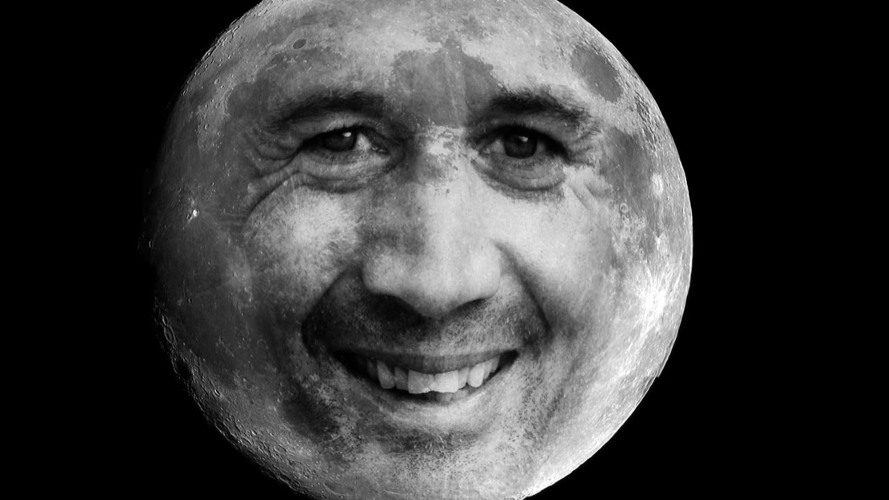

# Titre

La Lune est le seul satellite naturelle de la Terre. 

Icone créée par [affinity revolution](https://www.youtube.com/@AffinityRevolution) trouvée sur [Youtube](https://www.youtube.com).

## Caractéristiques

- Masse : 7.6 x 1022 kg

- Symbole: &#x263d; 
